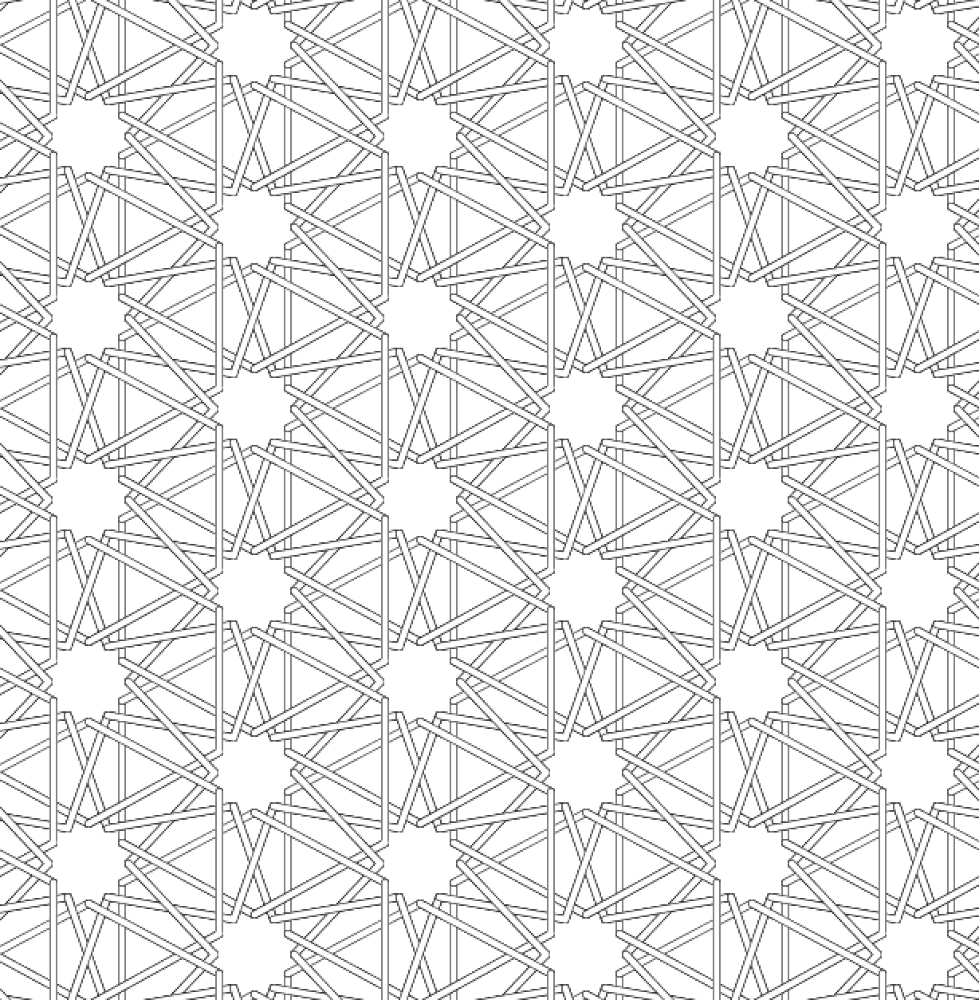

# Islamic Tiling Exercise

An exercise in making Islamic tiling patterns. Inspired by a recent viewing of the video "Building the Moroccan Court" ([on YouTube](https://www.youtube.com/watch?v=Og6cTlwBTrk)).  I learned this pattern from A. K. Dewdney's Computer Recreations in *Scientific American* v. 258 no. 6 (June 1988) pp.120-123. He teaches the technique of designing the pattern around circles. I'd forgotten all the details and had to work it out again. [notebook](../master/Islamic%20Geometric%20Patterns.pdf)

The processing sketch displays the framework. Sliders adjust the horizontal and vertical spacing between and the radius of the circles. A toggle switches between thin lines and wide lines which give the illusion of under-and-over latticework. The purpose is to find the most pleasing ratios.

I'm working on an algorithm for rendering the over-and-under latticework correctly.
